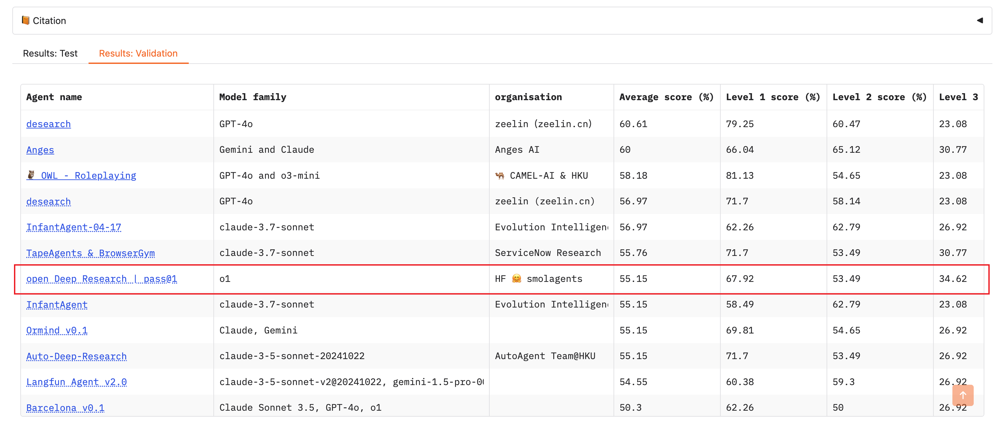

# Open Deep Research Optimization Report 

[Open Deep Research](https://github.com/huggingface/smolagents/tree/main/examples/open_deep_research) is an open-source agentic framework developed by Hugging Face that autonomously conducts web-based research. Built using the [smolagents](https://github.com/huggingface/smolagents) framework, it can browse the internet, extract and analyze information, and perform data manipulations to answer complex queries. 

## Performance on GAIA Validation Set 

We optimized the Open Deep Research framework using our proposed **SEWOptimizer**, with a primary focus on improving the prompts within the framework. We report the performance of the original and optimized prompts on the full GAIA validation set in the following table. 

| Implementation | Level 1 | Level 2 | Level 3 | Average |
|----------------|---------|---------|---------|---------|
| Original       | 28.30%  | 26.74%  | 0.00%   | 23.03%  |
| Optimized      | **33.96%**  | **29.07%**  | **7.69%**   | **27.27%**  |

The results indicate that our optimized prompts improve the performance by **18.41%** on average, with noticeable improvements on tasks from all three levels of the GAIA benchmark. 

In our experiments, we leveraged the `OpenAI o3` model to optimize the prompts, and used `gpt-4o-mini` to run the model during evaluation. The total investment for this optimization process was approximately $45, with the majority of the cost (about $42) from running the model with `gpt-4o-mini` for validation. These results indicate that our optimization process is cost-effective and can achieve remarkable performance improvements.  

## Why Open Deep Research?  

We chose Open Deep Research because it is **one of the few open-source, runnable frameworks on the [GAIA leaderboard](https://huggingface.co/spaces/gaia-benchmark/leaderboard)**. Most other submissions are either closed-source or lack runnable code. Alongside [OWL](https://github.com/camel-ai/owl) , Open Deep Research offers a strong baseline for evaluating and improving web-based research agents. While OWL is optimized in another teammate's repository, this work focuses on optimizing Open Deep Research for the GAIA leaderboard.  

<figure>
  
  <figcaption>Figure 1: GAIA Leaderboard showing Open Deep Research performance and ranking among other submissions</figcaption>
</figure>

## What We Changed 

We made the following modifications to the original framework:

1. **LLM Backbone** 

    We change the original `o1` LLM model (used in the leaderboard submission) with `gpt-4o-mini` in our experiments. 
    
    The main reason is the extremely high token consumption of this framework. In our preliminary tests, running just 50 samples with `o1` incurred about $150 in API fees. Running the full validation set of 165 examples would cost approximately $495, making it impractical for iterative optimization. To reduce the cost while preserving reasonable performance, we used the more cost-effective `gpt-4o-mini`. However, even with this smaller model, running the full validation set still costs around $55, highlights the inherently high token consumption of the Open Deep Research framework. 

2. **Optimized Prompts** 

    We optimized the prompts within the Open Deep Research framework using our proposed **SEWOptimizer**. In our experiments, we randomly sampled 25 questions from the GAIA validation set and used them as a validation subset for optimization. These optimized prompts can be found in the `src/smolagents/prompts` folder:
    - `code_agent_4o_mini_optimized.yaml`
    - `toolcalling_agent_4o_mini_optimized.yaml`

3. **Easier Run with `--optimized` Flag** 

   We modified the script `run_gaia.py` in the `examples/open_deep_research` folder to include the `--optimized` argument. This allows users to switch between original and optimized prompts effortlessly. You can follow the instructions under the folder `examples/open_deep_research` to run the framework. 

4. **Evaluation Script**

    We add a new script `evaluate.py` in the `examples/open_deep_research` folder to facilitate the evaluation of model outputs. 

5. **Evaluation Results** 

    To facilitate the evaluation, we provide the results of the original and optimized prompts on the full GAIA validation set in the `output/validation` folder:
    - results with original prompts: `gpt-4o-mini_results.jsonl`
    - results with optimized prompts: `gpt-4o-mini_optimized_results.jsonl` 

    These files can be directly used for quick comparison and reproduce the results. 

